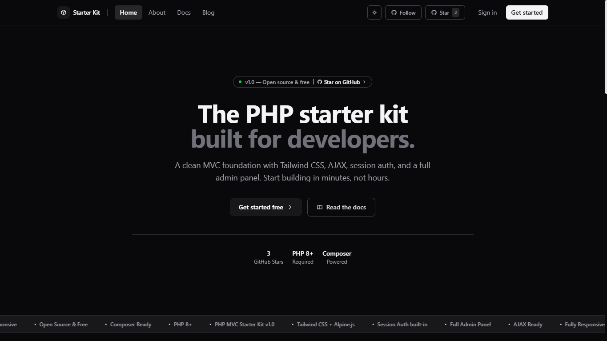
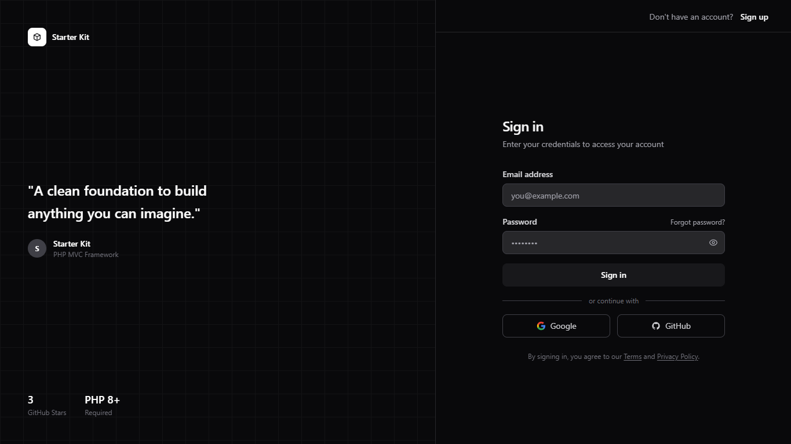
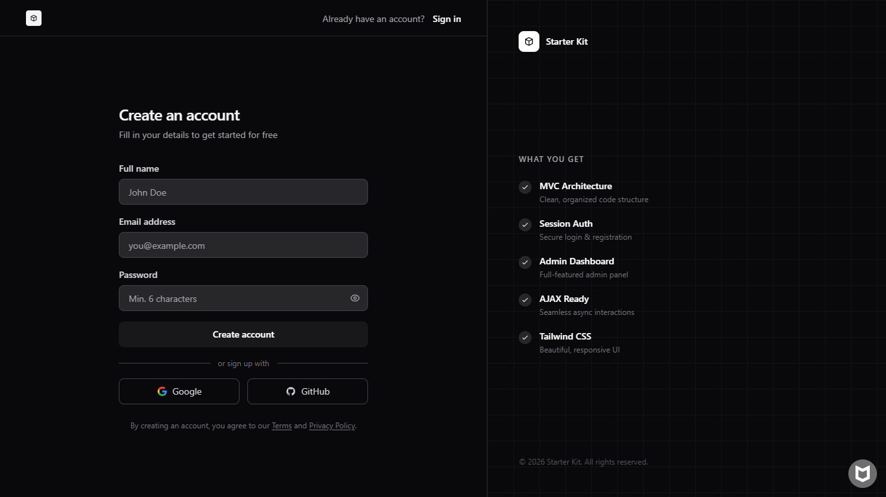
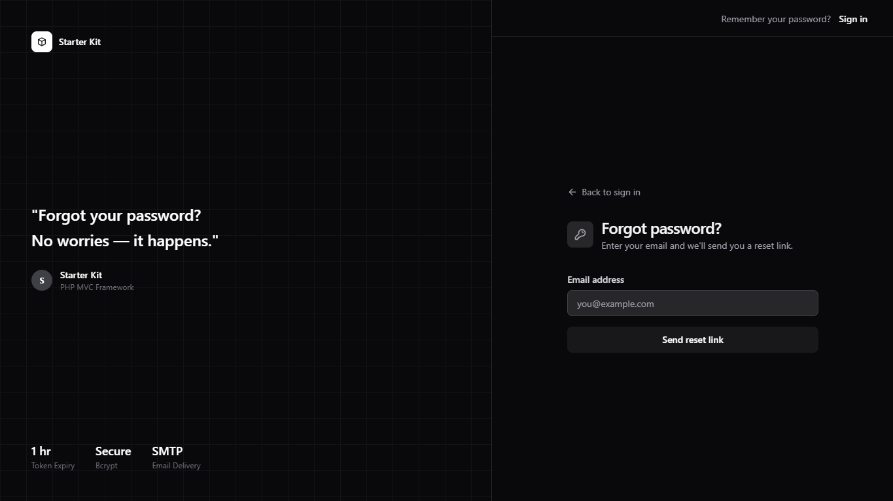
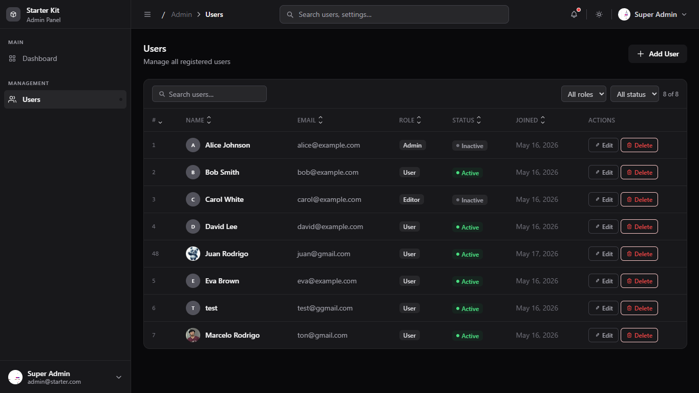
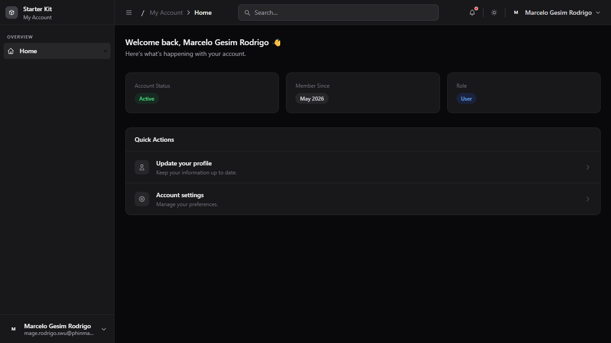

<div align="center">


# 🚀 Vanilla PHP MVC Starter Kit

### A clean PHP 8+ MVC boilerplate with a structured `js/` layer, split route files, super admin + admin panels, session auth with live password strength validation, role-based routing, OAuth (Google + GitHub), flash toast system, AJAX fetch helpers, Alpine.js reactive UI, Tailwind CSS, and PHPUnit — zero frameworks, zero fluff.

[⭐ Star on GitHub](https://github.com/rodrigomarcelo643/php-vanilla-mvc-starterkit) · [📖 Docs](#️-installation) · [🧪 Tests](#-testing)

</div>

---

## 📌 About

**Vanilla PHP MVC Starter Kit** is a lightweight, zero-framework boilerplate for developers who want a clean starting point without the overhead of Laravel or Symfony. Built on pure PHP 8+, it ships with a hand-rolled MVC architecture, session-based authentication, role-based routing, and a full admin panel — all wired up and ready to go.

The frontend uses Tailwind CSS and Alpine.js via CDN, so there's no build pipeline to configure. AJAX helpers, avatar uploads, password reset flow, and a responsive multi-panel layout (super admin, admin, app, client) are included out of the box.

Backed by PHPUnit with 77 tests across unit and feature suites, GitHub Actions workflows for linting, quality checks, and deployment, and a single SQL file to get your database running in minutes.

**Start building in minutes, not hours.**

### What's included

- **Multi-panel layout** — Super Admin, Admin, App (authenticated users), and Client (public) views
- **Session authentication** — Login, registration, logout, and password reset out of the box
- **OAuth login** — Google and GitHub sign-in with auto-prefill registration for new accounts
- **Role-based routing** — Segregated routes for super admin, admin, app, client, and AJAX calls
- **Super admin panel** — Highest-privilege panel with admin management, full user CRUD, purple-accented UI
- **Full admin panel** — Collapsible sidebar, topbar, user management, and data tables
- **Flash toast system** — `Session::flash()` sets one-time toasts, auto-fired on next page load
- **AJAX helpers** — Lightweight fetch wrappers for POST/GET with JSON responses
- **Avatar uploads** — Image preview, crop, and AJAX upload built in
- **Environment config** — `.env`-driven configuration, no hardcoded credentials
- **Tailwind CSS + Alpine.js** — Modern UI via CDN, no build step required
- **Composer managed** — PHPMailer, PHPUnit, and more via a clean `composer.json`
- **77 PHPUnit tests** — Unit and feature suites with automatic cleanup

---

## 🤔 Why This Over Laravel?

This starter kit is intentionally built **without Laravel** — and that's the point.

### 🎓 Built for Students
If you are learning PHP for the first time or studying MVC architecture, Laravel's abstractions (Eloquent, Facades, Service Containers) can hide what's actually happening under the hood. This kit exposes everything — the router, the auth system, the database layer — in plain, readable PHP so you can **see exactly how it works**.

> Start here. Understand MVC fundamentals. Then move to Laravel with confidence.

### 🏢 Built for Small to Medium Projects
Not every project needs the full weight of a framework. This kit is:
- **Lightweight** — no 30MB+ vendor folder, no service provider bootstrapping on every request
- **Shared-hosting friendly** — runs on basic Apache/XAMPP/Laragon setups without special server config
- **Fast to deploy** — one SQL import, one `.env` file, and you're live

### 🚀 A Natural Laravel On-ramp

| This Kit | Laravel Equivalent |
|---|---|
| `Router::get()` | `Route::get()` |
| `php kit make:controller` | `php artisan make:controller` |
| `php kit db:seed` | `php artisan db:seed` |
| `php kit migrate` | `php artisan migrate` |
| `.env` config | `.env` config |
| Middleware classes | Middleware classes |
| MVC structure | MVC structure |

The patterns here are intentionally **Laravel-inspired** — so once you understand this kit, transitioning to Laravel feels familiar, not foreign.

### ⚡ When to Use This vs Laravel

| Scenario | Use This Kit | Use Laravel |
|---|---|---|
| Learning MVC from scratch | ✅ | ❌ Too much magic |
| Small business site / portfolio | ✅ | ✅ |
| Shared hosting (cPanel) | ✅ | ⚠️ Can be tricky |
| Large enterprise SaaS | ⚠️ | ✅ |
| Understanding routing internals | ✅ | ❌ Hidden behind framework |
| Rapid API with auth/queues/etc | ⚠️ | ✅ |

---


<div align="center">

**Home**


**Sign In**


**Sign Up**


**Forgot Password**


**Admin Dashboard**


**User Panel**


</div>

> See the full visual walkthrough in [VISUALS.md](VISUALS.md)

---

## 📁 Project Structure

```
starterkit/
├── app/
│   ├── config/         # App, database, mail & OAuth config (reads from .env)
│   ├── controllers/    # MVC controllers
│   │   ├── auth/       # AuthController, OAuthController, PasswordController, ProfileController
│   │   └── superadmin/ # SuperAdminDashboardController, SuperAdminAdminController
│   ├── core/           # Router, Model, Auth, Session (+ flash), Database, Mailer
│   ├── helpers/        # Global helper functions
│   ├── models/         # Data models (User, Admin, SuperAdmin, PasswordReset)
│   └── views/          # Layouts, components & pages (superadmin/admin/app/client/auth)
├── assets/             # CSS & fonts
├── database/
│   └── starter.sql     # Database schema + seed data
├── js/
│   ├── admin/          # Admin-specific JS (admin.js, users.js)
│   ├── ajax.js         # Fetch wrapper (Ajax.post / Ajax.get)
│   ├── app.js          # Global utilities (toast, alert, setLoading)
│   ├── auth.js         # Auth form handlers + strength meter
│   ├── avatar.js       # Avatar upload with drag & drop + XHR progress
│   ├── logout.js       # Logout confirmation modal
│   ├── profile.js      # Profile edit + change password handlers
│   ├── settings.js     # Settings page theme sync
│   ├── sidebar.js      # Sidebar keyboard shortcut (Ctrl+B)
│   └── theme.js        # Dark/light mode toggle
├── routes/
│   ├── web.php         # Entry point — loads all route files
│   └── web/
│       ├── superadmin/ # Super admin page + AJAX routes
│       ├── admin/      # Admin page + AJAX routes
│       ├── app/        # Authenticated user page + AJAX routes
│       ├── auth/       # Auth page + AJAX + OAuth routes
│       └── client/     # Public/client page routes
├── storage/            # Uploads
├── tests/              # PHPUnit unit & feature suites
├── .agent/             # AI coding assistant context & prompt templates
├── .claude/            # Claude/Cursor context file
├── .github/workflows/  # CI/CD workflows
├── .env.example        # Environment template
├── .htaccess           # URL rewriting
├── composer.json       # Dependencies
└── index.php           # Application entry point
```

---

## ⚙️ Installation

### Requiremen

- PHP **8.0+**
- MySQL **5.7+**
- Apache with **mod_rewrite** enabled (XAMPP / Laragon / WAMP)
- Composer

### Steps

**1. Create the project via Composer**

```bash
composer create-project mardev/starter-kit my-app
```

Place it inside your server's web root (e.g., `htdocs/` or `www/`). Composer will automatically download the kit, install all vendor dependencies, and trigger the interactive setup wizard automatically.

**3. Set up the database**

- Open **phpMyAdmin**
- Go to **Import** and select `database/starter.sql`
- This creates the `starter` database with tables and seed data

**4. Configure environment**

```bash
cp .env.example .env
```

Edit `.env` with your values:

```env
APP_NAME="Starter Kit"
BASE_URL="/your-folder-path"

DB_HOST=localhost
DB_NAME=starter
DB_USER=root
DB_PASS=
```

**5. Visit the app**

```
http://localhost/your-folder-path
```

### Default Credentials

| Role        | Email                    | Password |
| ----------- | ------------------------ | -------- |
| Super Admin | superadmin@starter.com   | password |
| Admin       | admin@starter.com        | password |
| User        | alice@example.com        | password |

---

## 🧩 Installer Presets

When you run `composer install`, the setup wizard automatically launches and asks you to pick an installation mode:

```
====================================================
       Welcome to Vanilla PHP MVC Starter Kit
====================================================

Which preset would you like to install?
  [1] Full Stack (Alpine.js + AJAX Monolith) - Default
  [2] REST API (Full Stack with JS)
  [3] Backend Only (REST API, No UI)
  [4] jQuery Stack (Full Stack with jQuery AJAX)

Select an option [1]:
```

### Option 1 — Full Stack (Alpine.js + AJAX Monolith) *(default)*

The classic MVC full stack mode. All views are rendered server-side. AJAX calls use the `/ajax/` route prefix and return JSON. The `/api/` routes are also registered and available for external consumers alongside the HTML interface.

- ✅ All HTML views intact (client, admin, superadmin, app panels)
- ✅ Session-based auth with login/register pages
- ✅ AJAX endpoints under `/ajax/`
- ✅ REST API endpoints under `/api/` (JSON)
- ✅ `http://localhost/yourapp/` → renders HTML homepage

### Option 2 — REST API (Full Stack with JS)

Identical to Option 1 but injects the **smart `Controller`** which auto-detects `/api/` prefixed requests and switches them to JSON output mode. All HTML views remain intact. The frontend JS layer drives data via `/api/` fetch calls.

- ✅ All HTML views intact
- ✅ Smart `Controller` — `/api/` routes return JSON, page routes return HTML
- ✅ Session cookie reused for both browser and API requests
- ✅ `http://localhost/yourapp/` → renders HTML homepage
- ✅ `http://localhost/yourapp/api/admin/users` → returns JSON user list

### Option 3 — Backend Only (REST API, No UI)

Pure JSON API mode. All frontend assets (views, JS, CSS, client routes) are removed. Every request returns JSON. Use this when building a decoupled frontend (React, Vue, mobile app) that communicates with this backend via the `/api/` endpoints.

- ✅ All HTML views **removed**
- ✅ Only `routes/api.php` is loaded — pure JSON responses
- ✅ Smart `Controller` auth guard returns JSON `401`/`403` (no HTML redirects)
- ✅ `http://localhost/yourapp/` → returns JSON welcome message
- ✅ `http://localhost/yourapp/api/admin/users` → returns JSON user list

### Option 4 — jQuery Stack (Full Stack with jQuery AJAX)

Full stack traditional monolith mode leveraging **jQuery** instead of Alpine.js for interactive views and AJAX forms. The installer automatically downloads and incorporates the dynamic jQuery libraries.

- ✅ All HTML views intact (client, admin, superadmin, app panels)
- ✅ Session-based auth powered by custom jQuery AJAX calls
- ✅ Complete jQuery setup with preconfigured fetch/XHR handlers
- ✅ `http://localhost/yourapp/` → renders HTML homepage

### Comparison

| Feature                        | Option 1 | Option 2 | Option 3 | Option 4 |
|-------------------------------|----------|----------|----------|----------|
| HTML Views                    | ✅       | ✅       | ❌       | ✅       |
| Session Auth (Browser)        | ✅       | ✅       | ✅       | ✅       |
| `/ajax/` AJAX endpoints       | ✅       | ✅       | ❌       | ✅       |
| `/api/` REST endpoints (JSON) | ✅       | ✅       | ✅       | ✅       |
| Smart JSON/HTML auto-switch   | ❌       | ✅       | ✅       | ❌       |
| Root `/` returns HTML         | ✅       | ✅       | ❌       | ✅       |
| Root `/` returns JSON         | ❌       | ❌       | ✅       | ❌       |
| Primary Frontend Driver       | Alpine.js| Alpine.js| N/A      | jQuery   |

> You can re-run the installer at any time with: `php kit env:setup`

---

## 🛠️ Kit CLI Developer Tool

The starter kit comes with **Kit** (a custom PHP command-line interface helper) to streamline database setup, route inspection, scaffolding, cache management, and server management.

You can run commands using:
```bash
# On Windows/Unix
php kit [command] [arguments] [options]

# On Windows (shortcut)
kit.bat [command] [arguments] [options]
```

### Available Commands

#### 🗄️ Database Management
* `php kit db:fresh` — Drops all tables and re-imports the initial schema.
* `php kit db:seed` — Imports the baseline schema and seed data from `database/starter.sql`.
* `php kit migrate` — Runs all pending database migrations.
* `php kit migrate:rollback` — Rolls back the last batch of migrations.

#### 🏗️ Code Scaffolding
* `php kit make:controller [Name]` — Generates a new Controller class.
  * Options: `--admin` (places in admin folder), `--resource` (adds boilerplate CRUD methods).
* `php kit make:model [Name]` — Generates a new Model class.
  * Options: `--resource` (adds CRUD helper methods).
* `php kit make:view [folder/name]` — Generates a new View template file.
  * Options: `--resource` (creates standard list/show/create/edit views).
* `php kit make:middleware [Name]` — Generates a new Middleware class.
* `php kit make:migration [Name]` — Generates a new Migration template file.
* `php kit make:auth` — Generates full Authentication scaffolding (Controllers, Views, and Routes).

#### 🗺️ Routing
* `php kit route:list` — Lists all registered application routes, organized by request method, URI path, and handler.
* `php kit route:test` — Launches an **interactive API endpoint tester** directly in your terminal. Categorizes all registered `/api/` routes by group (Auth, Admin, Superadmin, Profile, App), sends real HTTP requests via cURL (including session cookies), and displays colorized JSON responses. Press `[ENTER]` to return to the menu after each request. Exit with `X` or `Ctrl+C`.

#### 💻 System & Development Utilities
* `php kit serve [host?] [port?]` — Starts the local PHP built-in development server with custom routing support.
* `php kit tinker` — Starts an interactive PHP REPL (Read-Eval-Print Loop) session to play with your models and databases.
* `php kit key:generate` — Generates a secure `APP_KEY` and updates it in your `.env` file.
* `php kit cache:clear` — Clears application cache files.
* `php kit logs:clear` — Clears application log files.
* `php kit optimize:clear` — Clears all compiled caches and logs at once.
* `php kit security:check` — Launches a full **Static Application Security Testing (SAST) and configuration audit scanner** on your project. It automatically audits your views for XSS prevention (untrusted raw outputs), database models for SQL injection patterns, authentication controllers for active CSRF protection headers, route input parameters for integer casting safety, secure cryptographic hashing algorithms (`password_hash`), rate-limiting middleware, and global HTTP security headers configuration.

### ⚙️ Environment & Routing Intelligence
* **Environment-Aware Server Router (`server.php`)**: Dynamically parses the `BASE_URL` from `.env` to strip any path prefix when serving requests using PHP's built-in development server (`php kit serve`).
* **Dynamic URI Parsing (`app/core/Router.php`)**: Fully decoupled from hardcoded subdirectory dependencies, allowing routing to work seamlessly whether served from an Apache alias (e.g., `http://localhost/starterkit`) or the built-in server (e.g., `http://localhost:8000`).

---

## 🗺️ Routes Overview

| File                    | Prefix             | Description                              |
| ----------------------- | ------------------ | ---------------------------------------- |
| `client/pages.php`      | `/`                | Public pages (home, about, blog…)        |
| `superadmin/pages.php`  | `superadmin/`      | Super admin dashboard, admins, users     |
| `superadmin/ajax.php`   | `ajax/admins/`     | Admin CRUD AJAX endpoints                |
| `admin/pages.php`       | `admin/`           | Admin dashboard, users, settings         |
| `app/pages.php`         | `app/`             | Authenticated user pages                 |
| `auth/ajax.php`         | `ajax/`            | Login, register + AJAX endpoints         |
| `auth/oauth.php`        | `oauth/`           | Google + GitHub OAuth redirect/callback  |
| `routes/api.php`        | `api/`             | Unified REST API — JSON-only endpoints for all roles |

### 🔄 Dynamic Routing Behavior by Preset Option

The active installation preset dynamically alters how routing and request handling are structured:

* **Option 1 (Full Stack - Alpine.js & AJAX)**:
  * Both web routes (`routes/web/`) and API routes (`routes/api.php`) are fully loaded.
  * Standard web controllers return rendered `.php` templates.
  * AJAX requests submit to the `/ajax/` prefix, returning JSON responses.
  
* **Option 2 (REST API - Full Stack with JS)**:
  * Web routes (`routes/web/`) and API routes (`routes/api.php`) are fully loaded.
  * The smart base `Controller` automatically detects incoming requests prefixed with `/api/`.
  * If a request is under `/api/`, it bypasses view rendering and outputs JSON payload data directly, making the server work seamlessly in both modes.

* **Option 3 (Backend Only - REST API)**:
  * The `routes/web/` folder is deleted entirely.
  * Only `routes/api.php` is loaded in `routes/web.php` for routing.
  * The router returns JSON only. Direct hits to the homepage `/` return an API welcome screen in JSON format.
  * Auth guards return JSON `401` or `403` status codes instead of HTML login redirects.

* **Option 4 (jQuery Stack)**:
  * Similar to Option 1, but routing is preconfigured to load jQuery scripts in layouts instead of Alpine.js scripts.
  * Interactive forms use standard jQuery-based XHR endpoints.

### 🛣️ Routing Architecture: AJAX vs. REST API vs. jQuery

Depending on the chosen installation preset, routing matches one of three distinct endpoint protocols:

#### 1. Standard AJAX Routes (`/ajax/*`)
Used in **Option 1 (Full Stack)**. These routes are designed for the monolith's frontend and return JSON.
* **Route Files**: Loaded via `routes/web/*/ajax.php`.
* **Path Prefix**: All routes are prefixed with `/ajax/` (e.g., `/ajax/login`, `/ajax/register`).
* **Frontend Handler**: Driven by Vanilla JS in `js/ajax.js` using standard `fetch()` calls.
* **CSRF Protection**: Automatically protected via custom `verifyCsrf()` middleware validating `X-CSRF-Token` headers.

#### 2. REST API Routes (`/api/*`)
Universal endpoints returned in JSON. Under **Option 3 (Backend Only)**, these are the *only* routes loaded. Under **Option 2**, they auto-switch dynamically.
* **Route File**: Contained inside the main `routes/api.php` file.
* **Path Prefix**: All routes are prefixed with `/api/` (e.g., `/api/auth/login`, `/api/admin/users`).
* **Format**: Enforces strictly JSON output.
* **Use Case**: Best for decoupled frontend frameworks (React, Vue, mobile apps) or programmatic access.

#### 3. jQuery Stack Routes (`/jquery/*`)
Active in **Option 4 (jQuery Stack)**. This rewrites the monolith's entire route and controller layers to use jQuery standard interfaces.
* **Route Files**: Loaded via `routes/web/*/jquery.php`.
* **Path Prefix**: All routes are rewritten with `/jquery/` (e.g., `/jquery/login`, `/jquery/register`).
* **Frontend Handler**: Handled via `js/jquery.min.js` and a custom `js/jquery_ajax.js` wrapper leveraging `$.ajax` calls.
* **Controller Bindings**: Action handlers are dynamically mapped to `jqueryLogin()`, `jqueryRegister()`, and other jQuery-specific methods.

---

### REST API Endpoints (`routes/api.php`)

All `/api/` routes return **JSON only**, regardless of installation mode.

| Method | Endpoint                        | Description                    |
|--------|---------------------------------|--------------------------------|
| `GET`  | `/api/ping`                     | Health check                   |
| `GET`  | `/api`                          | API info + endpoint list       |
| `POST` | `/api/auth/login`               | Login                          |
| `POST` | `/api/auth/register`            | Register                       |
| `POST` | `/api/auth/logout`              | Logout                         |
| `POST` | `/api/auth/forgot-password`     | Request password reset         |
| `POST` | `/api/auth/reset-password`      | Complete password reset        |
| `GET`  | `/api/admin/users`              | Get all users (admin)          |
| `POST` | `/api/admin/users`              | Create user (admin)            |
| `POST` | `/api/admin/users/update`       | Update user (admin)            |
| `POST` | `/api/admin/users/delete`       | Delete user (admin)            |
| `GET`  | `/api/admin/dashboard`          | Admin dashboard stats          |
| `GET`  | `/api/superadmin/admins`        | Get all admins (superadmin)    |
| `POST` | `/api/superadmin/admins`        | Create admin (superadmin)      |
| `POST` | `/api/superadmin/admins/update` | Update admin (superadmin)      |
| `POST` | `/api/superadmin/admins/delete` | Delete admin (superadmin)      |
| `GET`  | `/api/superadmin/users`         | Get all users (superadmin)     |
| `GET`  | `/api/superadmin/dashboard`     | Superadmin dashboard stats     |
| `GET`  | `/api/profile`                  | Get current user profile       |
| `POST` | `/api/profile/avatar`           | Upload avatar                  |
| `POST` | `/api/profile/update`           | Update profile                 |
| `POST` | `/api/profile/change-password`  | Change password                |
| `GET`  | `/api/app/home`                 | Authenticated user home data   |

---

## 👑 Super Admin Panel

The super admin is the highest-privilege role in the system. It has its own dedicated panel at `/superadmin/dashboard` with a purple-accented UI to distinguish it from the regular admin panel.

### What super admin can do

- **Dashboard** — Overview stats: total users, active/inactive users, total admins, new this month
- **Manage Admins** — Full CRUD: create, edit, delete admin accounts (`super_admins` table)
- **Manage Users** — Full CRUD on all user accounts (same as admin panel)
- **Profile** — Update name, email, avatar, and password
- **Settings** — Appearance and notification preferences

### Database table

Super admins are stored in a dedicated `super_admins` table, separate from both `users` and `admins`.

```sql
CREATE TABLE `super_admins` (
    `id`         INT UNSIGNED NOT NULL AUTO_INCREMENT,
    `name`       VARCHAR(100) NOT NULL,
    `email`      VARCHAR(150) NOT NULL,
    `password`   VARCHAR(255) NOT NULL,
    `avatar`     VARCHAR(255) DEFAULT NULL,
    `status`     ENUM('active','inactive') NOT NULL DEFAULT 'active',
    `created_at` DATETIME NOT NULL DEFAULT CURRENT_TIMESTAMP,
    `updated_at` DATETIME NOT NULL DEFAULT CURRENT_TIMESTAMP ON UPDATE CURRENT_TIMESTAMP,
    PRIMARY KEY (`id`),
    UNIQUE KEY `uq_super_admins_email` (`email`)
);
```

### New files added

```
app/models/SuperAdmin.php
app/controllers/superadmin/SuperAdminDashboardController.php
app/controllers/superadmin/SuperAdminAdminController.php
app/views/layouts/superadmin/header.php
app/views/layouts/superadmin/footer.php
app/views/components/superadmin/sidebar.php
app/views/components/superadmin/topbar.php
app/views/superadmin/dashboard.php
app/views/superadmin/admins.php
app/views/superadmin/users.php
app/views/superadmin/profile.php
app/views/superadmin/settings.php
routes/web/superadmin/pages.php
routes/web/superadmin/ajax.php
```

### Modified files

| File | Change |
|---|---|
| `app/core/Controller.php` | Added `superadmin()` layout method |
| `app/core/Router.php` | Added `app/controllers/superadmin/` to auto-discovery |
| `app/models/Admin.php` | Added `update()`, `delete()`, `adminCreate()` methods |
| `app/controllers/auth/AuthController.php` | Login checks `super_admins` table, redirects to `/superadmin/dashboard` |
| `app/controllers/auth/ProfileController.php` | Avatar upload, profile update, and password change support `superadmin` role |
| `app/controllers/admin/UserController.php` | Guard allows both `admin` and `superadmin` roles |
| `routes/web.php` | Loads super admin page + AJAX route files |
| `database/starter.sql` | Added `super_admins` table + seed account |

---

## 🔐 OAuth Login

Google and GitHub OAuth are wired up and ready — just add credentials to `.env` to activate.

### Flow

1. User clicks **Google** or **GitHub** on login or register page
2. Redirected to provider → user authenticates
3. **Existing email** → logged in directly, flash toast shown, redirect to dashboard
4. **New email** → redirected to `/register` with name + email auto-filled and locked, user only sets a password
5. On register submit → OAuth prefill cleared from session

### Setup

Add to `.env`:

```env
# Google: https://console.cloud.google.com/ → APIs & Services → Credentials → OAuth 2.0 Client ID
# Redirect URI: BASE_URL/oauth/google/callback
GOOGLE_CLIENT_ID=your-client-id
GOOGLE_CLIENT_SECRET=your-client-secret

# GitHub: https://github.com/settings/developers → OAuth Apps → New OAuth App
# Callback URL: BASE_URL/oauth/github/callback
GITHUB_CLIENT_ID=your-client-id
GITHUB_CLIENT_SECRET=your-client-secret
```

The toast renders bottom-right with a gradient background, progress bar, and auto-dismisses after 4 seconds.

---

The project uses **PHPUnit 11** with 77 tests and 98 assertions across two suites.

```
tests/
├── bootstrap.php               — loads .env, constants, and core classes for CLI
├── unit/
│   ├── RouterTest.php          — URI parsing, query strings, trailing slashes, isAjax, route registration
│   ├── AuthSessionTest.php     — Auth::check, Session set/get/destroy, edge payloads
│   └── HelperTest.php          — dd() output wrapping, types, nested arrays
└── feature/
    ├── UserModelTest.php       — create, findByEmail, findById, emailExists, count, getAll, default role/status
    ├── AdminModelTest.php      — findByEmail, role normalization, password verify, getAll
    └── AuthValidationTest.php  — login/register validation, bcrypt, role redirects, inactive status
```

| Suite | Tests | Needs DB |
|---|---|---|
| Unit | 32 | No |
| Feature | 45 | Yes |
| **Total** | **77** | — |

### Running tests

```bash
# All tests
php vendor/phpunit/phpunit/phpunit

# Unit only (no database required)
php vendor/phpunit/phpunit/phpunit --testsuite Unit

# Feature only (requires MySQL running with .env credentials)
php vendor/phpunit/phpunit/phpunit --testsuite Feature
```

Or via Composer:

```bash
composer test           # all
composer test:unit      # unit only
composer test:feature   # feature only
```

Feature tests hit the real database. Make sure your `.env` credentials are correct and `database/starter.sql` has been imported before running the feature suite. Test data is created and cleaned up automatically — no permanent records are left behind.

---

## ⚙️ GitHub Workflows

All workflows live in `.github/workflows/` and are **inactive by default** — they only run when manually triggered via **Actions → Run workflow**. Uncomment the `push`/`pull_request` triggers inside each file to activate them.

| File | Purpose | Activate on |
|---|---|---|
| `php-lint.yml` | Syntax-checks every `.php` file with `php -l` | push / PR |
| `php-quality.yml` | PHPMD mess detection + PHPCS PSR-12 style check on `app/` | push / PR |
| `secret-scan.yml` | Gitleaks scan for hardcoded credentials and API keys | push / PR |
| `sql-validate.yml` | Imports `database/starter.sql` into MySQL and verifies all tables | SQL file changes |
| `deploy.yml` | rsync deploy to remote server over SSH | push to main |

### Enabling a workflow

1. Open the workflow file in `.github/workflows/`
2. Uncomment the `push` / `pull_request` block under `on:`
3. Commit and push — GitHub Actions picks it up automatically

### Deploy secrets

Before enabling `deploy.yml`, add these in **Settings → Secrets → Actions**:

| Secret | Value |
|---|---|
| `SSH_HOST` | Server IP or hostname |
| `SSH_USER` | SSH username |
| `SSH_PRIVATE_KEY` | Contents of your `id_rsa` private key |
| `DEPLOY_PATH` | Absolute path on server e.g. `/var/www/html/project` |

---

## 🤖 Agent Context (AI Coding Assistant)

This project ships with ready-made context files for AI coding assistants so they understand the architecture, conventions, and patterns without you having to explain them every time.

```
.claude/
└── CLAUDE.md             # Context file for Claude (Cursor, Claude.ai)

.agent/
├── context/
│   └── project.md        # Universal project map — stack, patterns, DB, env vars
└── prompts/
    ├── scaffold-feature.md   # Prompt template: new controller + view + route
    ├── scaffold-model.md     # Prompt template: new model with CRUD methods
    ├── scaffold-ajax.md      # Prompt template: new AJAX POST endpoint
    └── debug-review.md       # Prompt templates: debug routes, views, controllers
```

- **Claude / Cursor** — paste or reference `.claude/CLAUDE.md` at the start of a session
- **Any agent** — point it to `.agent/context/project.md` for the full project map
- **Prompt templates** — copy a template from `.agent/prompts/`, fill in the placeholders, and send it to your agent

## 📈 Star History

<div align="center">

[](https://star-history.com/#rodrigomarcelo643/vanilla-php-mvc-starterkit&Date)

</div>

---

## 📄 License

This project is open-source software licensed under the **MIT License**. Created and maintained by **Marcelo Rodrigo (MarDev) - Software Developer**.

You are free to use, copy, modify, merge, publish, distribute, sublicense, and/or sell copies of the software, subject to the conditions outlined in the [LICENSE](LICENSE) file.

---


**Developed by [MarDev](https://github.com/rodrigomarcelo643) — Software Developer**

